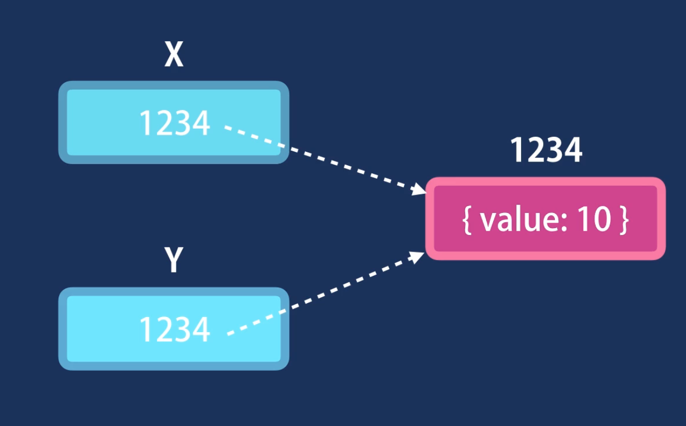

# Operators

- We can group variables with similar properties into a single object
- Value can have any datatype, including object, array or function

## OOP

- Object Oriented Programming is a style of programming where we see a program as a collection of objects that talk to each other to perform some functionality
- If a function is part of an object we call it method

## Factory Functions

- Usually created as Camel Notation `oneTwoThreeFour`
- Let's say we wanted multiple objects, repeating the same object again and again would work but if there's a large code and the same method is repeated multiple times and there's a bug in the method, we would need to change the bug in each and every object. A better way is to use factory functions
- Note that we can reduce code when we are initiating parameters:

```javascript
function example(parameter1) {
    const object {
        parameter1: parameter1,
        functionName: function() {
            statement;
        },
    };
    return object;
}
```

Can also be written as:

```javascript
function example(parameter1) {
  return {
    parameter1,
    functionName() {},
  };
}
```

## Constructor Functions

- Another pattern for creating objects
- Naming convention is different. We use Pascal Notation. First letter is uppercase as well `OneTwoThreeFour`
- We use a keyword called `this`. It is a reference to the object executing the piece of code
- Both constructor and factory functions are good, stick to one

## Dynamic Nature of Objects

- Objects are dynamic. Once they have been created you can always add properties or methods or remove existing ones

```javascript
const circle = {
  radius: 1,
};

circle.color = "yellow";
circle.draw = function () {};

console.log(circle);

delete circle.color;
delete circle.draw;
console.log(circle);
```

## Constructor Property

- Every object has a property called "Constructor"
- It references the function that was used to construct or create an object

```javascript
let x = {}; //let x = new Object();
```

- Various Constructors available:

```javascript
new String(); //'',"",``
new Boolean(); // true, false
new Number(); // 1, 2, 3
```

## Functions are Objects

- Functions have various methods and properties associated with them

## Value vs Reference Types

- Value types are also called Primitive types

### Primitive Types

- Copied by their value

1. Number
2. String
3. Boolean
4. Symbol
5. undefined
6. null

```javascript
let x = 10;
let y = x;

x = 5;
console.log(y); // will return 10
```

### Reference Types

- Reference types are copied by reference

1. Object
2. Function
3. Array

```javascript
let x = { value: 10 };
let y = x;

x.value = 20;

console.log(y.value); // will return 20
```


